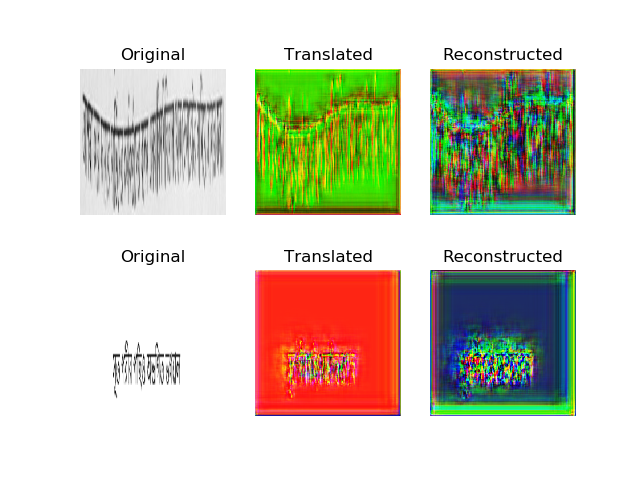
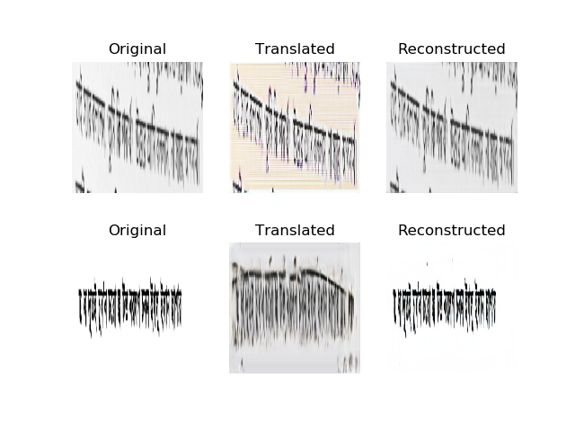
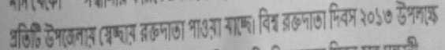
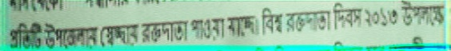

### Raw to synthetic domain transformation for OCR images. 

The project is structured as follows.

#### Codebase structure

* `dataset`: training data
* `images`: save generated images here 
* `saved_model`: save weights and model configurations here
* `test_imgs`: images for testing/generating target domain images
* `outputs` : demo images for showing output
* `.py` files #python scripts for training and inference

#### Dataset directory strucuture:

This is divided in the following file structure for the training regiment. The images are all in JPG format.

```
dataset/
	raw-to-syn/
		Domain_A/
			# all real world OCR images
		Domain_B/
			# all synthetic OCR images
		
		# 80% of Domain_A and Domain_B
		train_A/
			# real world images for training				    
		train_B/
			# synthetic images for training
		
		# 20% of Domain_A and Domain_B
		test_A/
			# around 300 samples real world images
		test_B/
			# around 300 samples synthetic images
```

### Training

Output when training is initiated.



Output during the end of training.



### Inference

Using the generator which transforms image from real OCR image and generate a synthetic OCR image.

Input to the generator:


Output from the generator:



###  Referece
* [Keras-GAN](https://github.com/eriklindernoren/Keras-GAN)
